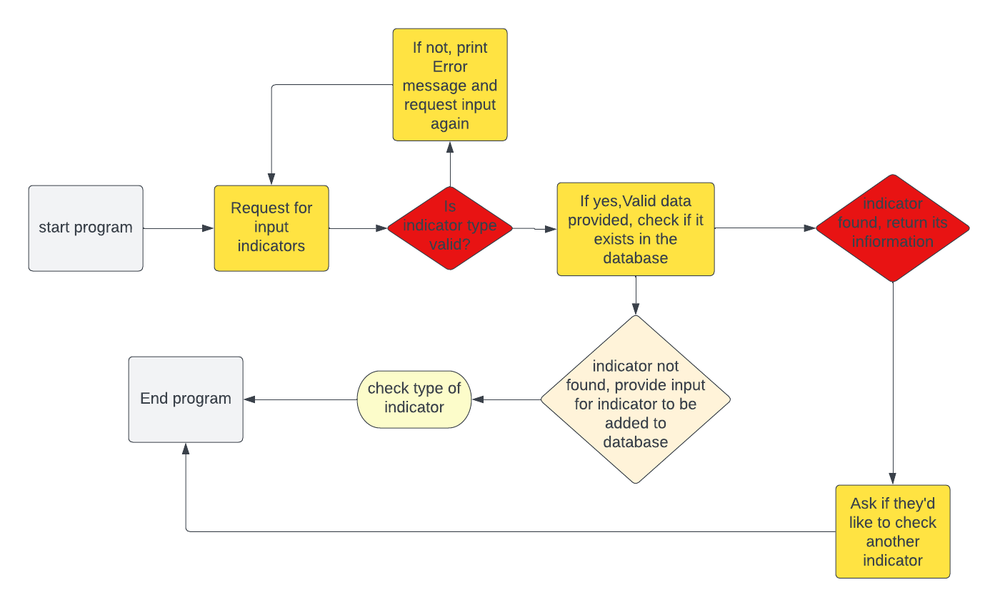
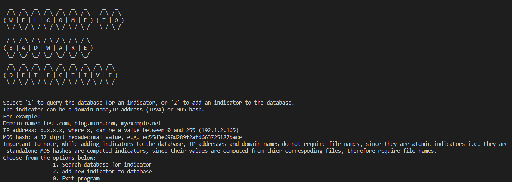
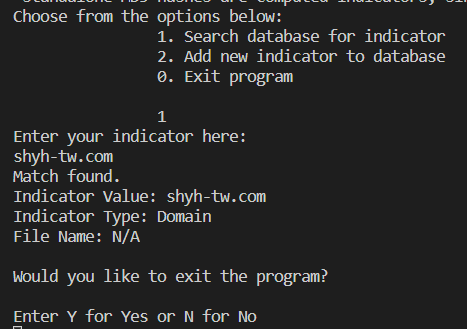
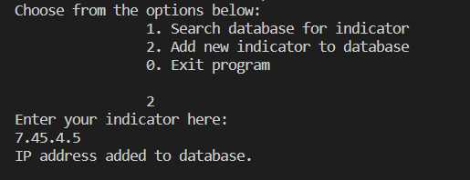
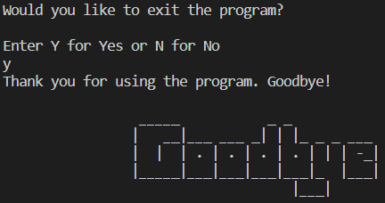
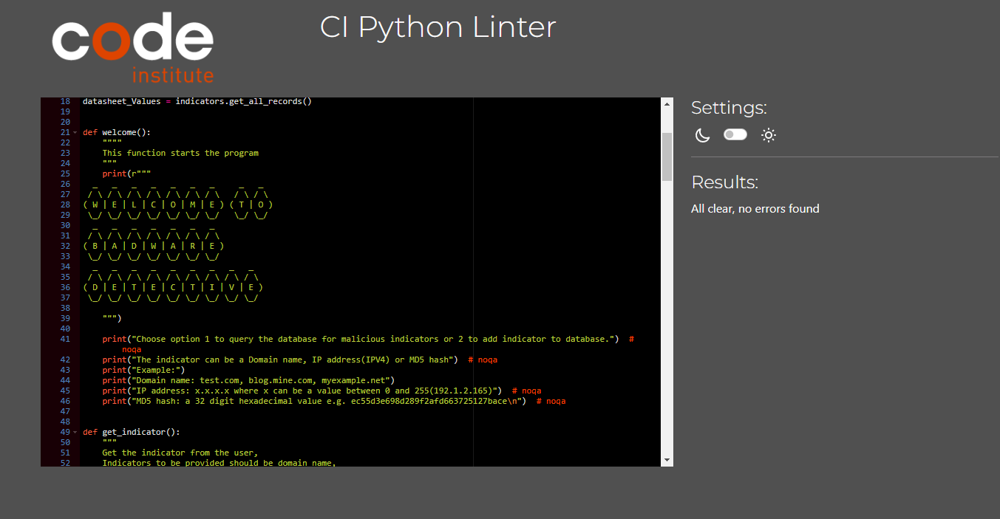

 Badware-Detective

Created by: Hope Tracy Njoroge

Find the Github repository here:
[Badware Detective](https://github.com/Njorogetracy/badware-detective)

Find the link to google sheet database here: 
[Googlesheet](https://docs.google.com/spreadsheets/d/1xRLNgJ16KS3MstorSBd0b7VMJsNOLLlUHf1vLBsQLb4/edit?usp=sharing)

# Introduction

This is an imagined program for a Cyber Security organization, in partial fulfilment with the Code Institute Full Stack Software Development course. It is targeted towards the Security Analysts, to check which malicious indicators are present in the company’s database and allow them to add any malicious indicators if not present to the database to protect the organization’s information assets. 

 

## [User Stories](#User-Stories)
## [FlowChart](#flowchart)
## [Design and Implementation](#design-and-implementation)
  ### [Features](#features)
## [Future Development](#future-development)
## [Technologies Used](#technologies-used)
## [Testing](#testing)
## [Bugs](#bugs)
## [Deployment](#deployment)
## [Credits and Acknowledgements](#credits-and-acknowledgements)

 

## User Stories
### As an app user:
- I want to build a program that allows users to search for malicious indicators
- I want to create a database with the indicator values, types and files names
- I want to allow my program to read the database
- I want to create a function that allows users to query the databse for present indicators
- I want to create a function that allows users to add indicators to the database
### AS a user:
- I want to be able to run the program
- I want to understand what to do through the instructions
- I want to choose what to do when I start the program
- I want to query the database to check if any malicious indicators already exit   
- I want to get the results of the indicator after querring the database
- I want to be able to add an indicator(s) to the database
- I want to exit the program as when I am done and satisfied after performing an action 

 

## FlowChart
 Find logic chart 

 

## Design and Implementation
  ### Features

### Existing Features

- Program start:
  - When the program starts, the badware-detective banner is printed alongside a set of instructions
  - The program menu is displayed with options for the user to pick the action they'd like to perform.
  - If option one is choosen, they search for the indicator in the database and get all it's info if found.
  - If it's not in the databse, they are given they option to add it to the database.
  - if they choose option 2, they can add indicator directly to the databse. 
  - Afterwhich, they are able to exit the program.
  - A goodbye message is printed after exiting the program. 
    - Start program
      
    - Search function
      
    - Add function
      
    - End program
      

 

## Future Development

- I would like to add a validation to avoid entry of duplicate values.
- I would like to add a regex exception to exclude IP 0.0.0.0 and 255.255.255.255 from being added
- I would like to allow for different multiple entries in the database.
- I would like to allow validation while adding to the databse, to ensure the input is the same.

 

## Technologies Used
- Git - Was used for version control, the Gitpod terminal to commit and push to GitHub.

- [GitHub](https://github.com/) - Was used to store the project code 

- [Lucid](https://lucid.app/documents#/dashboard) -  Was used to create the logic flowchart.

- [Heroku](https://www.heroku.com) - Was used to deploy the program.

- [Ascii Art](https://ascii.mastervb.net/) - Was used to design the welcome banner.

- [Regex101](https://regex101.com/r/fU2d35/1) - Used to verify that the regex patterns are correct.

- [Google Cloud API](https://cloud.google.com/apis) - API service used

- [Pep8](https://pep8ci.herokuapp.com/) - Validation service

- Googlesheets - Used as the database

 

## Testing
### Pep8 validation
This was done on Pep8, no errors were found.

### Manual testing
| Function | Testing | Completed |
|----------|---------| ----------|
| start program | starts program and loads instructions | yes |
| search database | searches database and returns indicator information | yes |
| add to database | adds indicator and its information to database | yes |
| end program | exits the program | yes|

 

## Bugs
  ### Fixed Bugs
  - Exit error
    - Expected - Exit program is expected to exit program when user inputs exit
    - Testing - Tested feature by inputing exit
    - Result - program exits and requests for input of value after exiting
    - Fix - added an exit function to the code to prompt program exit when user wants to exit.
  - Adding indicator to databse
    - Expected - Expected to add input to database once
    - Testing - Tested by inputting value and prompting add to database
    - Result - Adds 2 values to database
    - Fix - Done by removing duplicate input statements
  - ValueError from menu options
    - Expected - Raise error when input other than integer is entered
    - Testing - Added a letter and character
    - Result - "ValueError: invalid literal for int() with base 10: 'o'" printed to terminal
    - Fix - Adding a try and except statement

  ### Other Bugs
   - At the time of writing the readme, no known errors were found

 

## Deployment and development

  ### Deployment via Heroku
- Log into your Heroku page on [Heroku website](https://www.heroku.com)
- Go to your dashboard click "new" and then click "create new app".
- Give your app a unique name and make sure it's availble and then choose a region.
- Click "create app" button.
- Go to the "settings page".
- If you are using a creds.js file, follow the next steps:
    1. Scroll down and find the button that says "reveal config vars" and click it.
    2. Then write "CREDS" inside the box that says "KEY".
    3. With you github open find the creds.js file and copy paste it into the box beside "KEY" that says "VALUE".
    4. Now click the "add" button.
- If not, scroll to find the buildpacks and click on "add buildpacks"  
- Click on "python" and then click "save changes" button.
- Repeat the last two steps but add the nodejs buildpack.
- Now click on "deploy page".
- Click connect to Github in the deployment method.
- Then you search in your repository for the one yo need. Ensure the name is exactly the same.
- Click the button "serch" and then click "connect"
- Choose between automatic deployment or manual deplpyment.
- If you choose manual, wait for it to finish.
- Now click the button "view"

### Forking the Github repository
To make a copy of the original repository on a GitHub account, ao as to view and/or make changes without affecting the original repository use the following steps:

- Log in to GitHub and locate the repository badware-detective
- At the top of the Repository (not the top of the page) just above the "Settings" Button on the menu, locate the "Fork" Button.
- You should now have a copy of the original repository in your GitHub account.
- [Deployed Site](https://github.com/Njorogetracy/badware-detective) 

### Cloning the Github Repository
To clone the original repository:

- Log in to GitHub and locate the repository badware-detective
- Above the list of files(top right of screen), click Code
- Copy the URL using HTTPS, under "HTTPS"
- Type git clone in your terminal, and then paste the URL you copied
- Press Enter to create your local clone.

 

## Credits

- [W3schools](https://www.w3schools.com/python/default.asp) 
- [Geeks for geeks](https://www.geeksforgeeks.org/md5-hash-python/) - read on MD5Hash
- [Geeks for geeks](https://www.geeksforgeeks.org/switch-case-in-python-replacement/) - read on dictionary mapping
- [Geeks for geeks](https://www.geeksforgeeks.org/python-accessing-items-in-lists-within-dictionary/) - using a list of dictionaries
- [Gspread](https://docs.gspread.org/) - gspread documentation
- [O'REILLY](https://www.oreilly.com/library/view/regular-expressions-cookbook/9781449327453/ch08s15.html)- domain name regex
- [Abstract api](https://www.abstractapi.com/guides/python-regex-ip-address) - IPv4 regular expressions
- [Domain source](https://github.com/stamparm/blackbook/blob/master/blackbook.txt) - domain malware source
- [MD5 hash source](https://github.com/citizenlab/malware-indicators/blob/master/201608_Group5/hashes.csv) - hash file malware source
- [IP address source](https://www.projecthoneypot.org/list_of_ips.php) - IP address malware source

 

## Acknowledgements

- My Mentor Mitko Bachvarov, who walked me through my project idea, and gave me resources to guide me in the different stages.
- Tutor support, who helped me debug my validation function.
- My husband, who has supported me this far in my course.
- Slack, which has been an endless pool of informational resources throughout this project. 